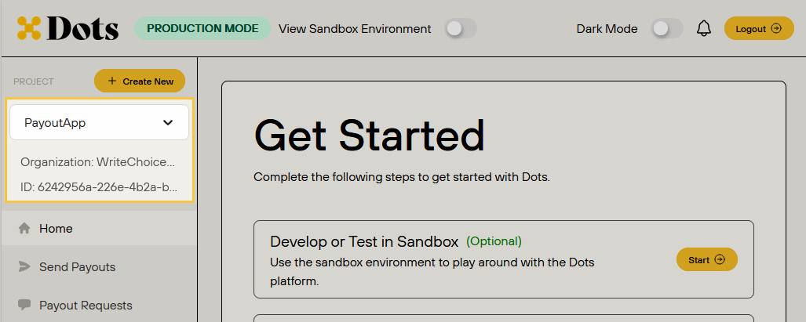

To start using one of Dots payout solutions you have to perform two basic steps:

- Create a Dots account.
- Create an App.

This page will walk you through the steps.

<Note>If you aren't familiar with the App concept in Dots, see the Applications section on the [Concepts](/overview/concepts#applications-apps) page.</Note>

## 1. Creating an Account

To create a Dots account, follow the steps presented below:

1. Visit the [Dots signup page](https://dashboard.dots.dev/signup) and fill out the required information to create your account.
2. Register a phone number to receive the verification code.
3. Use the verification code received on your phone to activate your account.
4. Once verified, log in to the Dots dashboard to find your credentials. For more information on how to access your credentials, see the [API Authentication](/overview/authentication) page.

## 2. Creating an App

After setting up your Dots account, the next step is to create an App. You can create an app through the Dots Dashboard:

1. Access and log in to the [Dashboard](https://dashboard.dots.dev/).
2. Click **+ Create New** on the sidebar to create a new App. 
3. Choose the **Organization**, provide an **App name**, and click **Create**.

<Note>If you use the Sandbox environment, the new App will be created with a wallet balance of $1,000,000.00. This enables you to test the payout features provided by Dots.</Note>

The new App will be available on the sidebar selector. The App ID will be available right below the selector.

<Frame>
    
</Frame>

## What's Next?

Now that you have a Dots account and have created an App, you can try one of the payout solutions provided by Dots:

- [Payout Links](/guides/payout-links)
- [Flow Payouts](/guides/flow-payouts)
- [White-labeled Payouts](/guides/white-labeled-payouts)