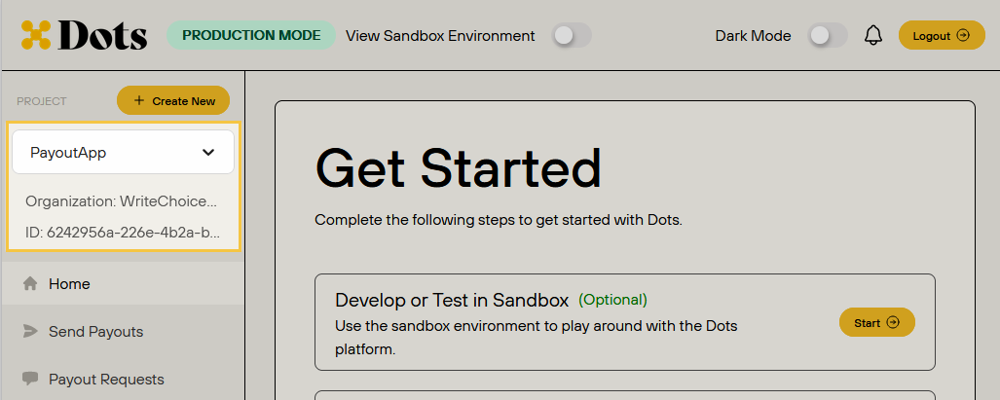

Payout Links is the most straightforward solution offered by Dots, allowing you to send money without the need to create a user or transfer manually. This guide will walk you through the steps to create a Dots account, set up an App, and use the Payout Links solution to send a payout.

You can send a payout link automatically through email or SMS or share the link manually. New payees will be guided through a quick onboarding process and given tons of convenient payment options to receive their payout.

## 1. Creating an Account

Before creating a payout, you need to create a Dots account:

1. Visit the [Dots signup page](https://dashboard.dots.dev/signup) and fill out the required information to create your account.
2. Register a phone number to receive the verification code.
3. Use the verification code received on your phone to activate your account.
4. Once verified, log in to the Dots dashboard to find your credentials. For more information on how to access your credentials, see the [API Authentication](/overview/authentication) page.

## 2. Creating an App

After setting up your Dots account, the next step is to create an App. You can create an app through the Dots Dashboard or using the API. Below, you find the steps to create the App using both options:

<Tabs>
  <Tab title="Dashboard">
    1. Access and log in to the [Dashboard](https://dashboard.dots.dev/).
    2. Click **+ Create New** on the sidebar to create a new App. 
    3. Choose the **Organization**, provide an **App name**, and click **Create**.

    <Note>If you use the Sandbox environment, the new App will be created with a wallet balance of $1,000,000.00. It enables you to test the payout features provided by Dots.</Note>

    The new App will be available on the sidebar selector. The App ID will be available right below the selector.

    <Frame>
        
    </Frame>
  </Tab>
  <Tab title="API">
    First, you need to have your credentials. Then, you'll use the Organization API key to create an app. Access the [API Authentication](/overview/authentication) documentation for more information.

    1. Access and log in to the [Dashboard](https://dashboard.dots.dev/).
    2. Select **Organization** on the sidebar, and then select **API Management** to have access to your **Client ID** and **API Key**. 
    3. Create an App using the [Create an App](/api-reference/apps/create-an-app). You have to use your **Client ID** and **API Key** to authenticate the request, as described in the [API Authentication](/overview/authentication). The following code block presents request and response examples.

    <CodeGroup>
    ```sh Request
    curl --request POST \
    --url https://pls.senddotssandbox.com/api/v2/apps \
    --header 'Authorization: Basic <token>' \
    --header 'Content-Type: application/json' \
    --data '{
    "name": "PayoutApp",
    }'
    ```

    ```json Response
    {
      "id": "73d5a2c2-020c-4db8-adad-de8f42f10774",
      "metadata": null,
      "metrics": {
        "connected_users": 0,
        "money_out": "0",
        "wallet_balance": "100000000"
      },
      "name": "PayoutApp",
      "status": "approved"
    }
    ```
    </CodeGroup>

    The response will provide the App `id`, which you'll use to create the Payout Link.

    <Note>If you use the Sandbox environment, the new App will be created with a wallet balance of $1,000,000.00. It enables you to test the payout features provided by Dots.</Note>
  </Tab>
</Tabs>

## Creating a Payout Link

You can create a Payout Link using the Dashboard or the API. Below you will find the steps to create a Payout Link using each of these options:

<Tabs>
  <Tab title="Dashboard">
    1. Access and log in to the [Dashboard](https://dashboard.dots.dev/).
    2. Select the desired App from the sidebar selector. 
    3. Access the **Send Payout** tab and select **Payout Links**.
    4. Provide the payout information. The only information required at this step is the **Amount** and the delivery method, which can be:
        - **Link**: Use this option to share the link manually.
        - **SMS**: If you choose this option, you must provide the payees' phone numbers. The link will be automatically shared.
        - **Email**: If you choose this option, you must provide the payees' email. The link will be automatically shared.
    5. Click **Submit**. 

    If you choose Link, the Payout Link will appear below the Submit button. If you choose SMS or Email, the link will be automatically shared.
  </Tab>
  <Tab title="API">
    To create the Payout Link using the API, you will need to use the **App API Key** and **Client ID**. You can find this information by accessing the Dashboard, selecting the desired App, and then selecting **API Management** on the sidebar. 
     
    With your credentials, you can create the Payout Link using the [Create a Payout Link](/api-reference/payout-links/create-a-payout-link) endpoint. The only required parameter is the `amount` value. However, you have several other options available, which are described in the following table:

    | Parameter                                 | Description                                                                                                                                                                              |
    |-------------------------------------------|------------------------------------------------------------------------------------------------------------------------------------------------------------------------------------------|
    | `user_id`                                 | The user's id.                                                                                                                                                                            |
    | `payee`                                   | The payee.                                                                                                                                                                                |
    | `amount`                                  | **REQUIRED**. Amount to be paid in cents.                                                                                                                                                 |
    | `delivery`                                | Delivery information.                                                                                                                                                                     |
    | `delivery.message`                        | Message to send in the SMS message that is sent to the payee.                                                                                                                                                    |
    | `delivery.method`                         | Delivery method. Options: `sms`, `link`, `email`, `all`.                                                                                                          |
    | `force_collect_compliance_information`    | Force the collection of 1099 or W-8 information.                                                                                                                                          |
    | `tax_exempt`                              | Payout links marked as `tax_exempt` will not be counted towards the 1099 threshold.                                                                                                        |
    | `metadata`                                | Set of key-value pairs that you can attach to an object. It is useful for storing additional information about the object in a structured format.                                           |
    | `memo`                                    | Add a memo to the top of the Payout Link.                                                                                                                                                  |
    | `idempotency_key`                         | Unique UUID key that prevents duplicate requests from being processed.                                                                                                                     |
    | `payout_fee_party`                        | Overrides the setting for which party will pay fees on this payout.                                                                                                                        |
    | `additional_steps`                        | Array of steps in the onboarding process. Options: `compliance`, `id-verification`, `background-check`, `manage-payments`, `manage-payouts`, `payout`, `redirect`.                                   |

    The following code block presents request and response examples of creating a Payout Link using the [Create a Payout Link](/api-reference/payout-links/create-a-payout-link) endpoint. 

    <CodeGroup>
    ```sh Request
    curl --request POST \
    --url https://pls.senddotssandbox.com/api/v2/payout-links \
    --header 'Authorization: Basic <token>' \
    --header 'Content-Type: application/json' \
    --data '{
    "amount": 123,
    "idempotency_key": "3c90c3cc-0d44-4b50-8888-8dd25736052a"
    }'
    ```

    ```json Response
    {
      "accounting_data": {
        "quickbooks_account_id": null
      },
      "amount": 123,
      "claimed_user_id": null,
      "created": "2024-07-11T12:31:33.479437",
      "delivery": {
        "country_code": null,
        "email": null,
        "method": "link",
        "phone_number": null
      },
      "description": null,
      "flow_id": "7c22fd05-147e-48bb-b008-f48f24b76ea4",
      "id": "e5d5863a-498d-4551-a3dc-e31012503f23",
      "link": "https://my-sandbox.dots.dev/flow/7c22fd05-147e-48bb-b008-f48f24b76ea4",
      "memo": null,
      "metadata": null,
      "payee": {
        "country_code": null,
        "email": null,
        "first_name": null,
        "last_name": null,
        "phone_number": null
      },
      "status": "delivered",
      "tax_exempt": false,
      "transfer_id": "c1d3ec40-e05e-4385-acd6-c587372c4c3a"
    }
    ```
    </CodeGroup>

    The `link` parameter in the response will provide the Payout Link you can share with the payee.
  </Tab>
</Tabs>

## Using the Payout Link

When the payee receives and uses the Payout Link, they'll be redirected to the Dots portal. The payees will be guided through a quick onboarding process. The payee will complete the following steps:

1. Enter a phone number.
2. Verify the phone number.
3. Submit the IRS Form W-8BEN. 
4. Select the payment method.
5. Provide the payment method information.

Payees can retrieve their funds using several payout rails, such as local bank transfers, wire transfers, and PayPal. Access the [Supported Countries](/references/supported-countries) page to see what payment options are available in your country.

The following video presents an example of when the payee doesn't need to submit the IRS Form W-8BEN and selects the Amazon Gift card as the payment method.

<Frame>
  <video autoPlay controls>
    <source src="/videos/payout-link-1030-800.mp4" type="video/mp4"/>
    Your browser does not support video tags.
  </video>
</Frame>
