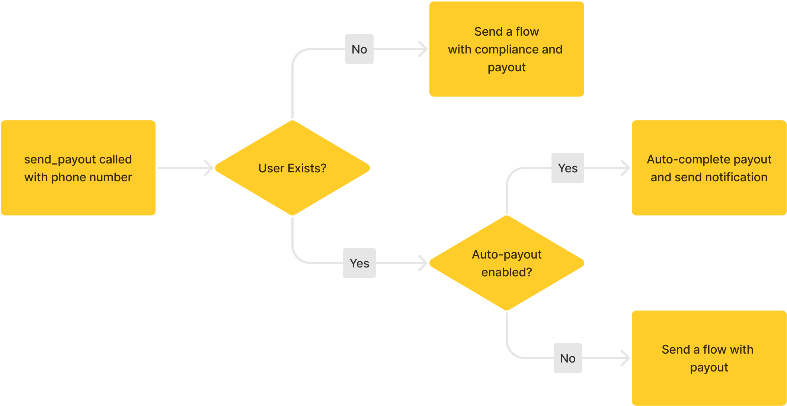

A payout is a transfer of funds from your account to a user's external account. The easiest way to send a payout is through the `send-payout` route. If the user exists within the Dots system, the funds are sent to them based on their saved preferences, otherwise, they are sent a link to onboard.



## 1. Create an App

If you haven't already, create an account at [https://dashboard.dots.dev](https://dashboard.dots.dev) and switch over to Sandbox mode. Head over to the `API Management` tab to generate keys.

## 2. Send the Payout

We will create and send a `Payout Link` to a user whose phone number is known with US $10.

### Request

Please replace the phone number with your own.

```bash cURL
https://pls.senddotssandbox.com/api/v2/payouts/send-payout \
-X POST \
-u "CLIENT_ID:API_KEY" \
-H "Content-Type: application/json" \
-d "{
      "delivery": {
        "message": "My first payout"
      },
      "amount": 1000,
      "payee": {
        "country_code": "1",
        "phone_number": "2025550139"
      }
    }"

```

Dots will then text the user with either a link to claim their funds or notify them that the funds have been transfered to their default payout method.
