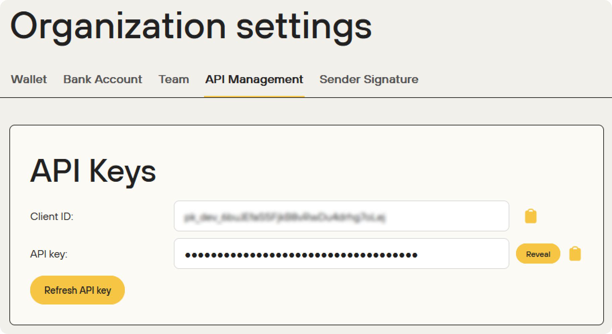

The Dots API uses a Basic token approach to authorize requests. When you perform an API request, you must inform the token created using your `client_id` and `api_key`.

<Warning>Do not share your secret API keys in public places like Github or Gitlab since this opens space for malicious API calls.</Warning>


## Basic Token Format

The Basic token is a URL-safe Base64 encoding of a string that contains your `client_id` and optionally your `api_key`. Depending on whether your request comes from a server or the client side, the token will contain different information, as described in the following table.

| Origin      | Token composition |
|-------------|-------|
| Client side | `BASE64_ENCODE({client_id}:)` |
| Server side | `BASE64_ENCODE({client_id}:{api_key})` |

<Note>You should include `:` after your `client_id` when generating the token from the client side.</Note>

Suppose your `cliend_id = ABC123` and `api_key = DEF456`, you would have the following resulting tokens:

<CodeGroup>

```javascript Client side
BASE64_ENCODE(ABC123:) -> QUJDMTIzOg==
```

```javascript Server side
BASE64_ENCODE(ABC123:DEF456) -> QUJDMTIzOkRFRjQ1Ng==
```
</CodeGroup>

To authenticate your requests, you'll send the token through the header of your request, following the structure presented below:

```javascript Header format
Authorization: Basic {token}
```

## Dots Keys

When working with Dots, you have access to organization and App keys, which you will use in different scenarios to authenticate your requests to the Dots API.

<Note>Your organization and App keys change when you toggle between the Sandbox and Production environments. See the [Environments](/overview/environments) page for more information. Therefore, if you're changing from the Sandbox to the Production environment, remember to change the keys in your code.</Note>

### App Keys

Dots enables you to create and use [applications (Apps)](/overview/concepts#applications-apps), which is helpful for multi-tenancy applications where you want to logically separate funds and users on your platform. 

Every new App has its own App Keys, which you can use to authenticate all operations related to that App.
<Tip>
See [Basic Token Format](#basic-token-format) to learn how to generate the token before sending your requests.
</Tip>

To access your App key, access the [Dots dashboard](https://dashboard.dots.dev/), select the desired App through the sidebar selector, and then select **API Management**. Your App Key will be shown like exemplified below:

<Frame>

</Frame>


### Organization Keys

Organization keys are used to authenticate Dots operations across all the applications in your organization. You can use them to create, update, and delete apps and act on behalf of Apps. When using organization keys to execute App operations, you must inform the organization key and the `Api-App-Id` to identify the App. The following code block presents how to use the organization key to create an App and send a payout. 

<Tip>
  You will always inform your authentication key in a token format when using the Dots API. See [Basic Token Format](#basic-token-format) on this page to learn how to generate the token before sending your requests.
</Tip>

<CodeGroup>

```curl Create App
curl --request POST \
--url https://api.dots.dev/api/v2/apps \
--header 'Authorization: Basic <token>' \
--header 'Content-Type: application/json' \
--data '{
  "name": "<app_name>",
}'
```

```curl Send Payout
https://pls.senddotssandbox.com/api/v2/payouts/send-payout \
-X POST \
-u "CLIENT_ID: <organization_key>" \
-H "Content-Type: application/json" \
-H "Api-App-Id: <app_id>" \
-d "{
    "delivery": {
    "message": "My first payout"
    },
    "amount": 1000,
    "payee": {
      "country_code": "1",
      "phone_number": "2025550139"
    }
  }"
```
</CodeGroup>

To access your organization keys, you can email info@dots.dev, or you can access the [Dots dashboard](https://dashboard.dots.dev/), select **Organization** on the sidebar, and then select **API Management**, like exemplified below:

<Frame>

</Frame>

If you're using the organization key to authenticate actions on an App's behalf, you need to include the App's ID with the `Api-App-Id` header in the request. The ID can be retrieved using the [List All Apps](/api-reference/users/list-all-users) endpoint or the [Dashboard](https://dashboard.dots.dev/).
